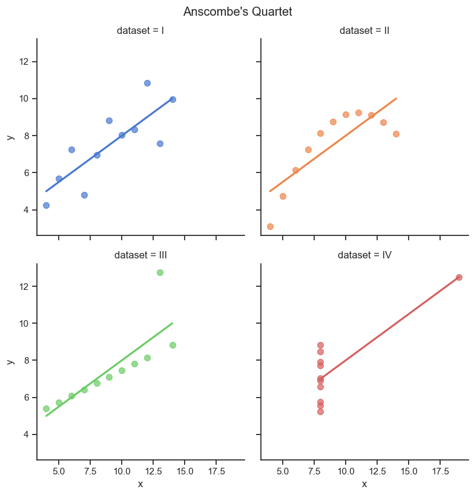

Assignment-based Subjective Questions
1. From your analysis of the categorical variables from the dataset, what could you infer about their effect on the dependent variable?
    - 
2. Why is it important to use drop_first=True during dummy variable creation?
    - It is important to use `drop_first=True` to avoid having perfect multicollinearity.
    - If we don't use drop_first=True, all our columns that we got out of `pd.get_dummies` have highly collinear with each other which will affect our model with high VIF values. Eventually we will have to drop them to reduce VIFs. So it's better if we drop them at the time of creation itself.
3. Looking at the pair-plot among the numerical variables, which one has the highest correlation with the target variable?
    - temp and atemp numerical variables have the highest correlation.
4. How did you validate the assumptions of Linear Regression after building the model on the training set?
    - The residuals (aka error-terms) should have a normal distribution. We verify by plotting a kdeplot and a qqplot for the residuals.
    - The residuals should be homoscedastic. This means the residual's variance should lie within a limited horizontal band and it should be neither decreasing, not increasing. Also it should be funnel shaped.
    - The residuals should not have a relationship with other predictor variables. One way to check this independence is to plot a y-pred vs residuals plot. If the residuals are scattered all over the place and no clear pattern is visible, we declare that our residuals are independent. The other way is to verify if the durbin-watson value is around 2.
    - Model evaluation
        - During every modelling(with different combination of predictor variables), we can also create a plot of y_test and y_test_pred and expect a strong positive correlation.
        - We check for overfitting or underfitting by comparing the r-squared-scores of both training and test data over our model.
5. Based on the final model, which are the top 3 features contributing significantly towards explaining the demand of the shared bikes?
    - 

General Subjective Questions
1. Explain the linear regression algorithm in detail.
    - Out of the different problems to solve with machine learning, linear regression algorithm tries to solve the problem of prediction of numerical values for a target variable given a single or a bunch of predictor variables are linearly associated with it. These linear associations can be weak or strong, they can be positive or negative.
    - a linear relationship can be built like so, y = b0 + b1X1 + b2X2 + ... where each b is the coefficient (or weight) assigned to a predictor variable X. b0 is not associated with any predictor variable and is the intercept of the line in a hyperplane(in case of multiple predictor variable). The higher the value of b, the more that corresponding predictor variable is associated with the target variable. It would also mean that for a unit change in the predictor variable, the target variable will change by b, given all the other predictor variables are kept constant.
    - We start with a thorough exploratory data analysis to understand what the data is describing at the moment.
        - fix for missing values
        - outlier treatment
        - conversion of data to proper datatypes
        - derived columns(domain wise, expansion of dates, etc)
        - univariate, bivariate analysis
    - We create a pairplot between all the numerical variables to verify that there are some variables which have good correlation with the target variable.
    - Next, we convert all our categorical variables to numerical columns by expanding them into multiple columns. We use the technique of binary-encoding (for yes-no, true-false type of categorical columns). For categorical columns having more than 2 categories, we use `pd.get_dummies` to create multiple columns with a 0 or 1. The column-name takes the value of the text. We also apply the `drop_first=True` argument to drop one of the columns to avoid perfect multicolinearity.
    - Next, we split the dataset into training and testing data and we keep them completely isolated with each other.
    - Next, we apply scaling to our training dataset using the min-max (normalization) or standardized(z normal distribution) scaling depending on the usecase. We keep the output of the scaling method safe to use for purposes of scaling our testing data as well. We wil also need this output of scaling method to be used at a later stage when we convert the target-variable to the inverse-scaling-transformed value.
    - Next, we create a heatmap between all the variables to look for strong positive/negative correlations. This will be useful when we do feature elimination.
    - At this point, we have multiple numerical columns, from which we need to create our model that can predict the target variable. There are many ways we can arrive at our final list of predictor variables. But to save time, we start with RFE (Recursive Feature Elimination), which is available to use with the help of python libraries like `sklearn`. RFE arrives at our desired number of predictor variables with the help of automation. It compares all combinations of predictor variables and assign ranks to the predictor variables. These ranks are a representation of how strongly a predictor variable is related to the target variable. Generally, out of all the variables, we take the top 20 predictor variables and continue a manual feature elimination based on our domain knowledge.
    - Next, we do modelling. Based on our training data (predictor variables and target variable), we calculate the model with the help of `ordinary least squares` algorithm. Before we pass in the training data to the ordinary least squares algorithm, we add another column to our training data which represents the "constants" (the intercept of the model). statsmodel.OLS treats constants as yet another predictor variable and tries to come up with coefficients of all the predictor variables (including the constants) which can define the target variables value. It's the best fit line (in the hyperplane in case of multiple linear regression) which is closest to the data points with least error. Internally the ordinary least squares will run the gradient descent algorithm to arrive at the final set of coefficients which have the least errors compared to other model-coefficients.
    - Once we have a potential model ready, we need to do a model verification. We consider multiple things when we verify our model
        - variables with higher than 0.05 p-values are not significant, we need to remove them
        - variables with high VIF (a representation of how a particular predictor variable is highly correlated to other predictor variables) need to be removed
        - other variables which we think do not contribute to the model should be removed based on our EDA analysis and our domain knowledge
    - Other considerations we need for our model is that it follows the assumptions of linear regression. These are the various assumptions of linear regression
        - The residuals (aka error-terms) should have a normal distribution. We verify by plotting a kdeplot and a qqplot for the residuals.
        - The residuals should be homoscedastic. This means the residual's variance should lie within a limited horizontal band and it should be neither decreasing, not increasing. Also it should be funnel shaped.
        - The residuals should not have a relationship with other predictor variables. One way to check this independence is to plot a y-pred vs residuals plot. If the residuals are scattered all over the place and no clear pattern is visible, we declare that our residuals are independent.
    - Model evaluation
        - During every modelling(with different combination of predictor variables), we can also create a plot of y_test and y_test_pred and expect a strong positive correlation.
        - We check for overfitting or underfitting by comparing the r-squared-scores of both training and test data over our model.
    - Our objective is to keep running modelling for different combination of predictor variables until we get the best value of
        - no more insignificant (high p-value) variables
        - no highly multicolinear variables (VIF should be less than 5)
        - Adjusted R-square
        - Low difference between r2 score of training and test data
        - low RMSE, low MAE of the residuals
    - Once we have our final model, our final outcome should be
        - the model
        - the output of scaling
        - various statistics proving the correctness of our model
        - actionable inferences
    

2. Explain the Anscombe’s quartet in detail.
    - 

    - If you look at the image above, all 4 graphs seem different. But if you do a descriptive analysis of the underlying dataset, all 4 have exact same descriptive statistics value. Same mean, same standard deviation etc.
    - Statistician Francis Anscombe created this graphs to demonstrate that graphical analysis holds importance and we shouldn't just rely on numerical calculations.
    - A dataset is as good as our interpretation. While mathematical calculations are certainly a way to analyse data, we shouldn't forgo the importance of graphs. Sometimes we rely on automation scripts and not look at graphical representations at all. This can lead to unknown issues, which could have been solved if we just had a look at how the data looks visually.
    - Anscombe's claim is important for linear regression because just having a look at the R-squared and Adjusted-R-squared is not enough. Even if you got a good R-squared/Adjusted-R-squared, a low mean-square-error, it doesn't mean that the assumptions of linear regression are followed. Only an inspection of residual plot will tell if the residuals are following a constant variance, if residuals are homoscedastic.

3. What is Pearson’s R?
    - Pearson's R gives a quantifiable value of correlation between 2 variables.The exact formula is the ratio of covariance of 2 variables & product of standard deviation of the 2 variables. Covariance tells us about how 2 variables are changing together and can span between -inf to inf. It does not give a lot of actionable information in itself. But when we can control the value of covariance by dividing it with a measure of spread of both variables, we get the correlation value which can be used to make inferences and comparisions. Pearson's R correlation value only tells about how strong or how weak a relationship between 2 variables is in terms of strength and direction(positive or negative correlation). What it doesn't tell is how much a variable will increase or decrease with a unit change in the other variable. For that, we use linear regression. Linear regression adds further information between the relationship between 2 variables by giving the value of slope of the line.
    - Pearson's R correlation value is also agnostic of the scale of the data.
    - Pearson's R correlation only tells about how strongly or weakly 2 variables are associated. It does not claim that change in one variable is the "cause" of change in other variable. Causation can be found by having domain knowledge, or by having a direct interaction with the individual who created the data and created derived variables.
    - Pearson's R is a value between -1 and 1 where -1 denotes strong negative correlation, i.e. one variable goes down when the other goes up and vice versa. 1 denotes that both variables go up together. A value of 0 would denote that there is no correlation at all between the 2 variables.

4. What is scaling? Why is scaling performed? What is the difference between normalized scaling and standardized scaling?
    - Datasets contain variables with different ranges of values. for example, an age column can contain data in the range of 18-100, but in the same dataset an "income" column can contain data in the range of 30000-1000000. Smaller values of some columns and larger values of some columns doesn't say anything about the importance of those variables. Also, smaller and larger variables are not comparable since they represent different things.
    - Real-world wise and domain wise, these variables can not be compared to each other by the smallness or largeness of there values. But mathematics is unaware of the domain. For mathematics, these are just numbers. A large value from one variable is actually compared and declared larger than the smaller value of another variable. There are machine learning algorithms whose output depends on this smallness and largeness of different variables. There are machine learning algorithms whose output doesn't depends. But for performance optimisations and better readability of the outputs, we should perform scaling.
    - Take example of a gradient descent algorithm which is used to find global minimas of a cost function. If the variables are not scaled, the assigned values of coefficients will change by moving more in the direction of a particular variable which has larger values. The reason for this is because the error between actual and calculated values will be much higher for large range variables. For mathematics calculations, this higher error is more significant that a lower error for some other variable. Also, it's possible that the variable which is being given more importance because of higher error term is less significant domain-wise as compared to other variable with lower error terms. Without scaling gradient descent algorithm will take longer to converge to the global minima as it will spend a lot of time in resolving errors for higher range variables first.
    - If we want mathematics to consider the variables with equal importance we need to bring them to a similar scale. "age" between 0 to 1 and "income" between 0 to 1 can still be treated as a comparable value between different individuals. At the same time, mathematics will give equal importance to these variables by assigning weights to these variables which are comparable. For example, in the real world scenario, assume that age predicts the target variable more than income, the weight(coefficient) of age will look in the order of thousands, and income in the order of tens, if we don't scale. But if we scale, the weights will look comparable, for example. 0.8 for age and 0.2 for income.
    - Normalized scaling will scale the data to come between 0-1. The formula is x-xmin/xmax-xmin. As you can see, this will be impacted by outliers. So if we want to use this, we should get rid of the outliers first. If we want to interpret comparison of X1 and X2 by looking at their coefficients, we should first convert to their original scale and then compare.
    - Standardized (or z-score normalization) transforms the data such that the mean of the data becomes 0 and the standard deviation becomes 1. This technique of scaling takes care of outliers. Interpretability is easier here since 1 standard deviation change-of-Y in X1 can be compared by 1 standard deviation change-of-Y in X2 directly.

5. You might have observed that sometimes the value of VIF is infinite. Why does this happen?
    - VIF(Xi) = 1/(1 - R-squared-i). VIF is a measure of colinearity between one predictor variable and all the other remaining predictor variables.
    - VIF can become infinity in case of perfect multicolinearity (or R-squared-i = 1). This means that a particular predictory variable, whose VIF turned out to be infinity, has perfect colinearity with one or more other predictor variables.
    - Cases of infinite VIF are, existence of another predictor variable which is exactly the same, a predictor variable is derived from other predictor variable in a linear fashion, dummy variables were created without dropping one of the columns which will lead to all the dummy variables to have infinite VIF since one of them can be defined by all the others together.

6. What is a Q-Q plot? Explain the use and importance of a Q-Q plot in linear regression.
    - The correctness of linear regression model depends on a few assumptions. One of the assumptions is that the residuals a.k.a error-terms (difference between y-observed and y-predicted) should be random in nature. The histogram( or kde plot) for the residuals should be normally distributed. A normally distributed bell curve is easy to view and interpret as a graph where we can see that the mean is around 0 and there is no skewness. But verifying that each and every datapoint on the curve is following a normal distribution is hard to see in the kde plot. 
    - What is easier to verify is that if most of the data points lie on a straight line, specially on top of a reference straight line. QQ plot gives us the ability to see this exact thing. QQ plot is a representation of normal distribution over a straight line. The x-axis is the theoretical quantile (z-score) of a standard normal distribution. the y-axis is the actual quantile (z-score) of the data. In case of linear regression, we want to plot the QQ plot for residuals, so the y-axis will contain the z-score of residuals.
